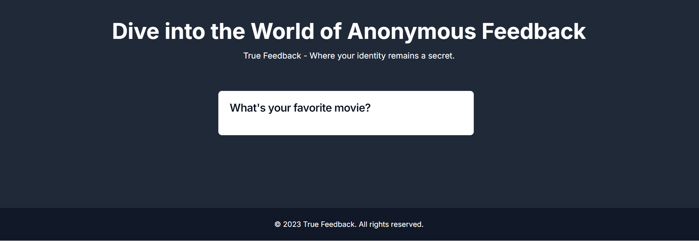
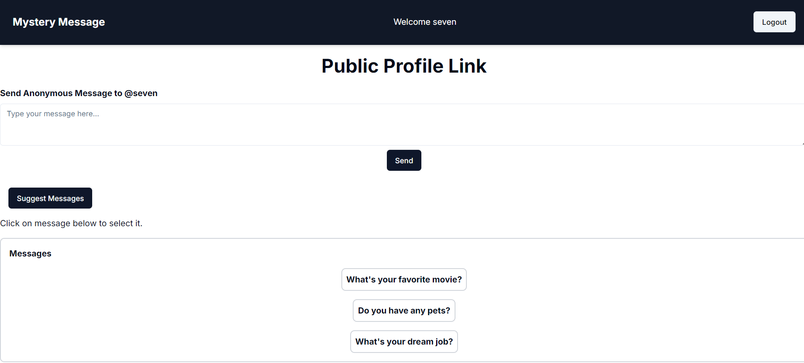
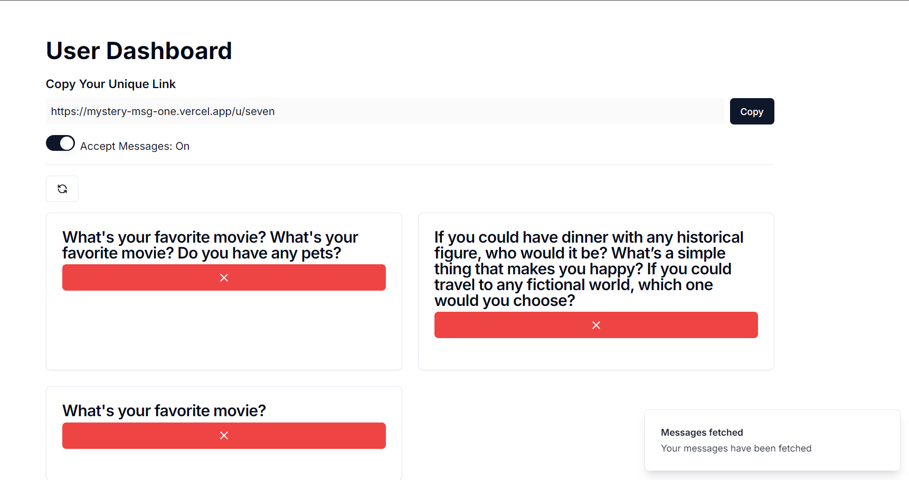

# Mystery Message Website

A **platform where users can receive anonymous messages** from anyone, ensuring a fun and mysterious interaction. Built with modern technologies to provide an engaging user experience.


## Tech Stack

- **Frontend**: Next.js, TailwindCSS, TypeScript, Shadcn
- **Backend**: MongoDB
- **AI Integration**: Gemini AI


## Features

- **Anonymous Messaging**: Users can send and receive messages without revealing their identity, fostering a fun and mysterious interaction.
- **User-Friendly Interface**: Designed with **TailwindCSS** for a sleek and intuitive interface, enhancing user engagement.
- **Real-Time Updates**: Utilizes **Next.js** for server-side rendering and real-time updates, ensuring a smooth experience.
- **AI Integration**: Integrated **Gemini AI** to genrate random messages for user.
- **Secure Data Management**: Implemented **MongoDB** for secure storage and management of messages and user data.

## Screenshots






## Run Locally

Clone the project

```bash
  git clone https://github.com/Uzairkazi695/mystery-msg.git
```

Go to the project directory

```bash
  cd mystery-msg
```

Install dependencies

```bash
  npm install
```

Start the server

```bash
  npm run dev
```


## Environment Variables

To run this project, you will need to add the following environment variables to your .env file

`MONGODB_URI `

`RESEND_API_KEY `

`NEXTAUTH_SECRET`

`GEMINI_API_KEY`

## Future Enhancements

- **User Profiles**: Implement user profiles for a personalized experience.
- **Message Filtering**: Add options to filter and categorize messages.


## Contributing

Contributions are always welcome!


## License

This project is licensed under the [MIT](https://choosealicense.com/licenses/mit/) License.

